<div align="center">
  
  <h1>NextEFB</h1>
  <p><strong>Charts aligned. Flights connected.</strong></p>
  <p>A local-first desktop flight-deck companion for Microsoft Flight Simulator.</p>

  <p>
    <a href="https://github.com/immrk/next-efb/releases/latest"></a>
    <a href="https://github.com/immrk/next-efb/actions/workflows/release.yml"></a>
    
    
    <a href="LICENSE"></a>
  </p>
</div>

> [!IMPORTANT]
> **Little Navmap must be installed before using NextEFB.** NextEFB does not include any navigation data; it reads all navigation data from Little Navmap. To update the navigation database, use Navigraph to update Little Navmap's navigation data, then reload the data in NextEFB.

## Overview

NextEFB brings live simulator data, flight planning, personal charts, georeferencing, checklists, and network traffic into one Electron application. It is designed for pilots who want to organize their own chart library and keep the same workflow available on a Windows desktop and other devices on the local network.

The application stores operational data locally. Network-backed features connect only when used, including map tile providers, SimBrief, VATSIM, remote chart URLs, and GitHub Releases.

<p align="center">
  
</p>

## Highlights

- **Live flight map** — reads aircraft position and telemetry from MSFS through SimConnect, with follow mode and configurable map providers.
- **Route planning** — builds routes from Little Navmap navigation data and imports flight plans from SimBrief.
- **Personal chart library** — imports PDF and image charts, edits metadata, binds procedures, and organizes reusable chart bundles.
- **Georeferencing and overlays** — aligns a chart from reference points and mounts it directly on the moving map.
- **Checklists** — keeps aircraft-specific PDF and image checklists alongside the flight workflow.
- **VATSIM awareness** — displays pilots, controllers, coverage, ATIS, and airport weather on the map.
- **LAN companion** — exposes the main interface to trusted devices on the same network, with optional token authentication.
- **Automatic updates** — checks stable GitHub Releases and installs Windows updates from inside the app.
- **Internationalization** — supports English, Simplified Chinese, Traditional Chinese, Japanese, and Korean. The first launch follows the operating-system locale; unsupported or untranslated content falls back to English.

### Feature showcase

#### Live map and mounted charts

Track the active flight, inspect navigation data, and keep the route visible above a georeferenced chart. Mounted SID, STAR, approach, and airport charts stay aligned with the moving map while nearby traffic and navigation features remain available.

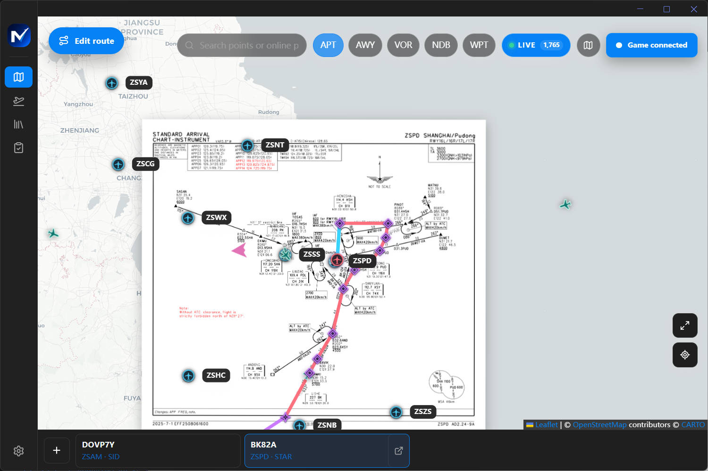

#### Route planning and SimBrief

Build a route from Little Navmap navigation data or import a SimBrief operational flight plan. Review procedures on the map, then keep the full flight summary, load sheet, timing, fuel, weather, and route data in the same workflow.

| Route and procedure planning | Imported SimBrief briefing |
| :---: | :---: |
| 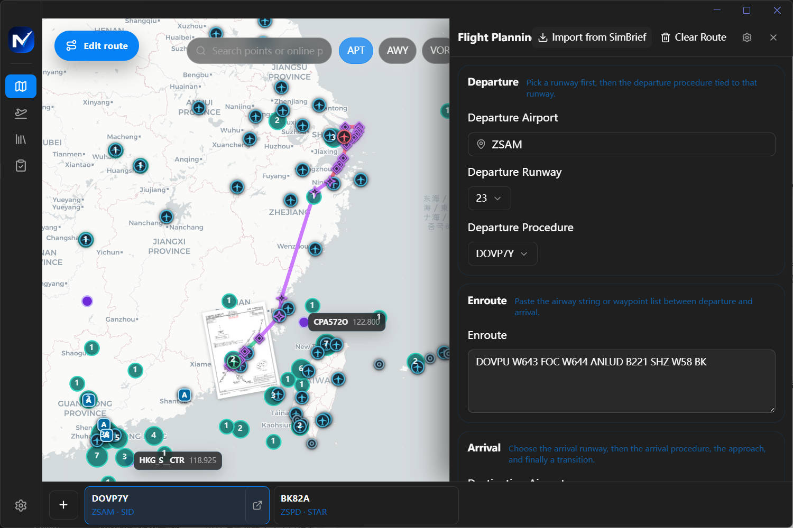 | 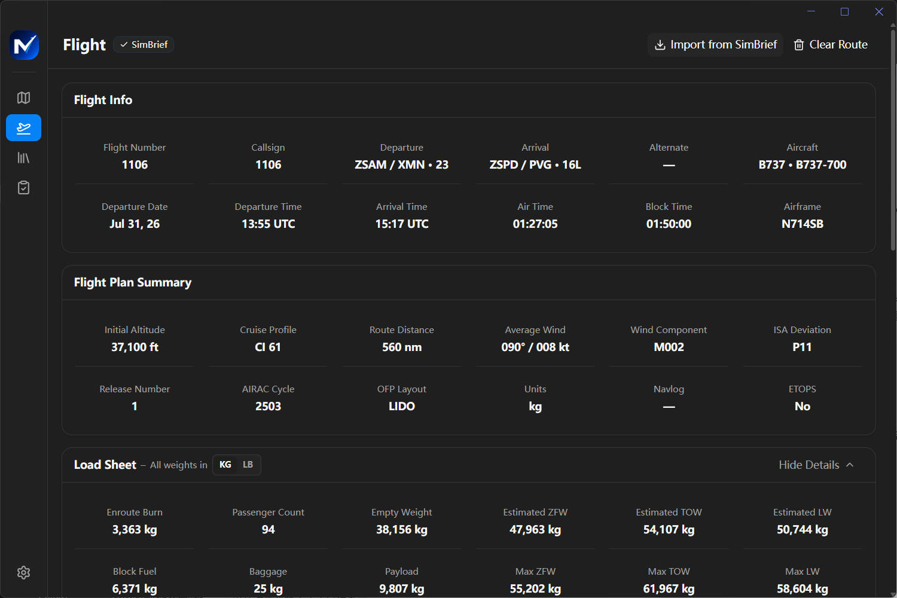 |

#### Personal chart library and one-click URL import

Import local PDF or image files, organize charts by airport and type, and keep reusable chart bundles in a private library. For online import, paste a direct chart PDF URL and select **Download**—NextEFB retrieves and adds the chart in one step.

[ChartFox](https://chartfox.org/) is the recommended free chart source for flight simulation: open the required chart, copy its direct PDF URL, paste it into NextEFB, and select **Download**. ChartFox requires a free VATSIM account. Chart availability and usage remain subject to the original provider's terms; charts are for flight simulation only and must not be used for real-world navigation.

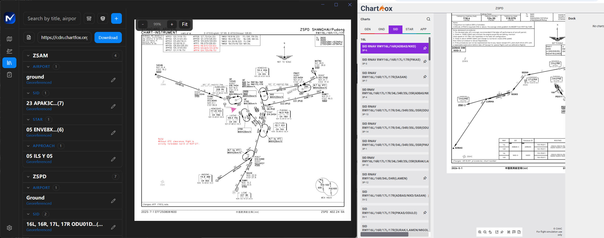

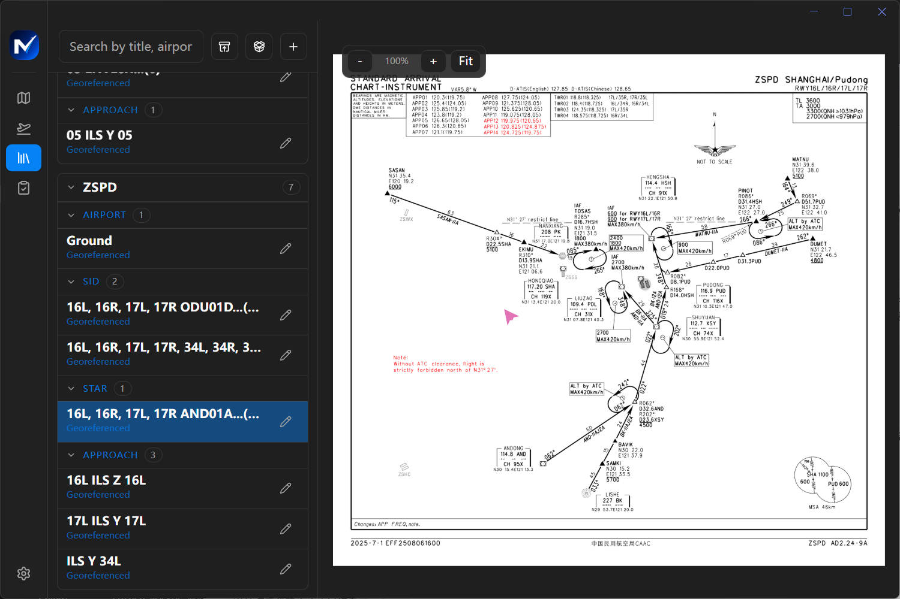

#### Georeferencing and procedure binding

Align a chart with two corresponding map and chart reference points, then bind metadata such as airport, chart type, runway, and associated procedures. Once saved, the chart can be mounted directly on the moving map.

| Two-point georeferencing | Runway and procedure binding |
| :---: | :---: |
| 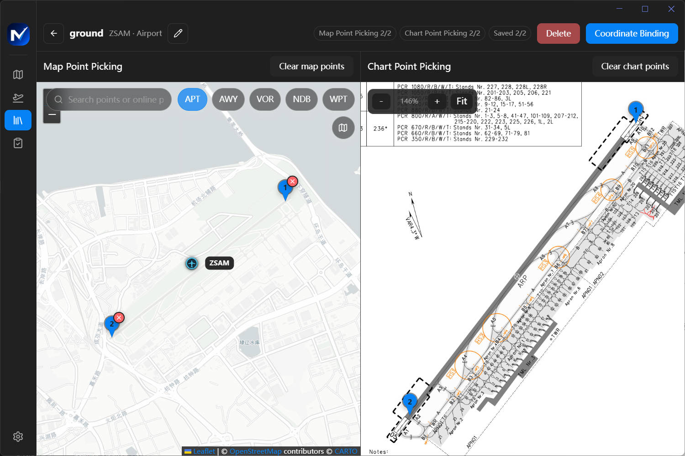 | 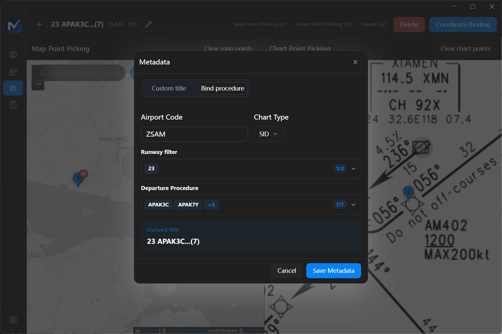 |

#### VATSIM traffic, controllers, and weather

Enable individual VATSIM layers, inspect online pilots and filed routes, and open airport cards with live METAR-derived weather and operational details.

| Network layers | Online pilot details | Airport weather |
| :---: | :---: | :---: |
| 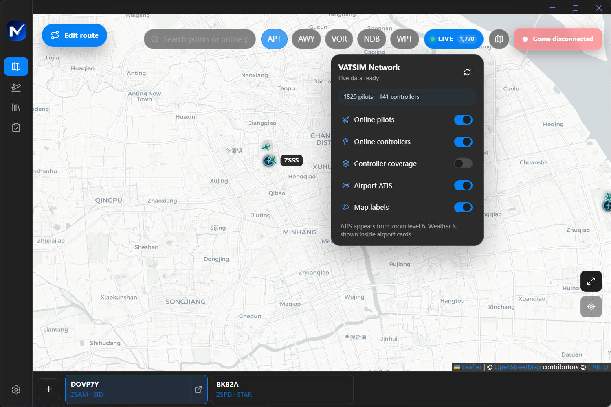 | 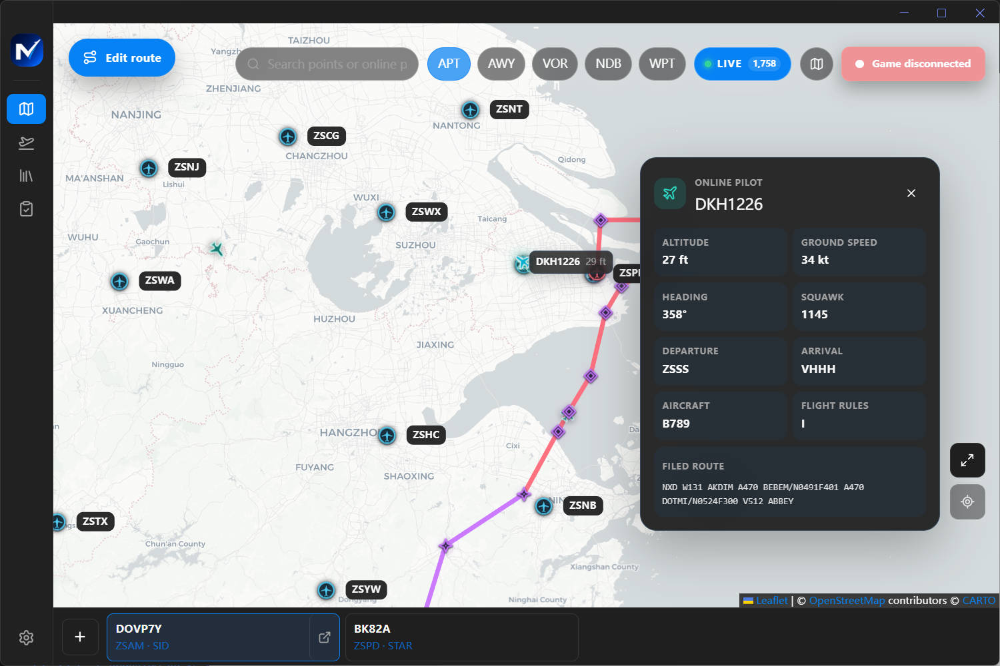 | 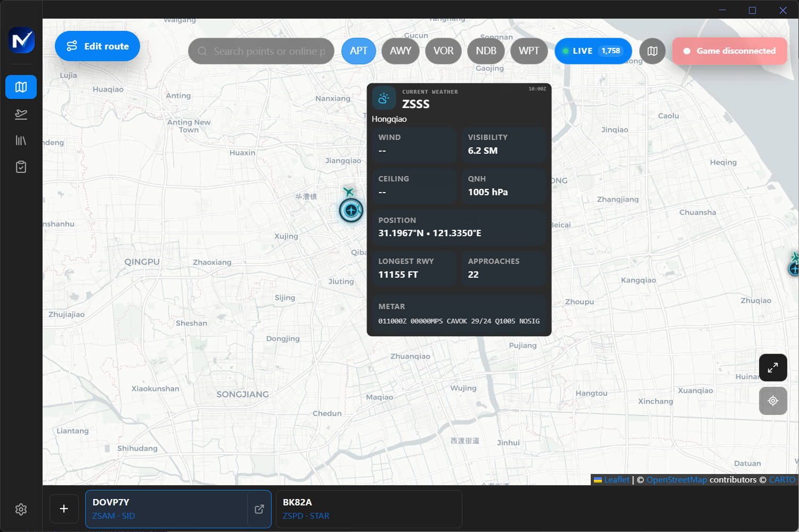 |

#### Aircraft checklists

Keep PDF and image checklists grouped by aircraft type, searchable, and ready beside the map and flight plan without leaving the application.

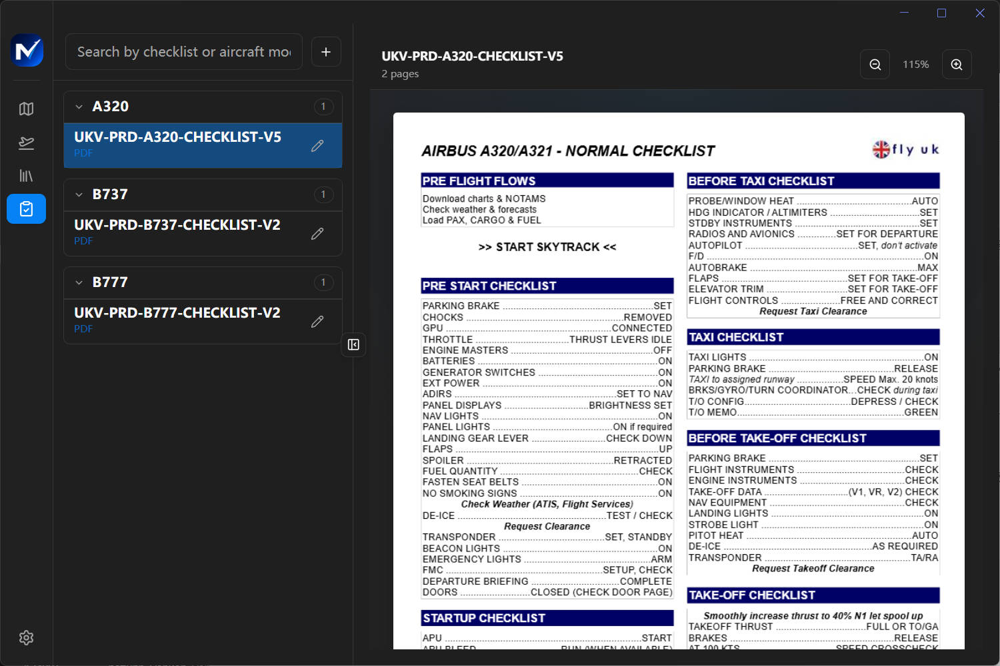

## Requirements

### End users

- Windows 10 or Windows 11, x64
- Microsoft Flight Simulator 2020/24 for live SimConnect data
- Little Navmap installed with an available navigation database
- Optional: SimBrief account for flight-plan import

### Contributors

- Windows with PowerShell
- Node.js 22 and npm
- A native C++ build toolchain if a prebuilt binary is unavailable for `better-sqlite3` or `node-simconnect`

## Install a release

Download the current Windows installer from [GitHub Releases](https://github.com/immrk/next-efb/releases/latest), run `NextEFB-<version>-Setup.exe`, and follow the setup wizard.

Unsigned development builds may trigger a Windows warning. Production releases should be code-signed as described in [the release guide](docs/RELEASE.md).

## Development

Clone the repository and install the locked dependency graph:

```powershell
git clone https://github.com/immrk/next-efb.git
cd next-efb
npm ci
npm run rebuild-native
```

Start the renderer development servers:

```powershell
npm run dev
```

Then launch the `Electron TS Development` configuration from VS Code. To continuously rebuild the Electron main process in a separate terminal, run:

```powershell
npm run watch
```

To run only the main renderer window:

```powershell
npm run dev -- --only=main
```

## Quality checks

Run the same core checks used by the release pipeline before opening a pull request:

```powershell
npm run typecheck
npm run test:unit
npm run build
```

Additional commands:

| Command | Purpose |
| --- | --- |
| `npm run test:coverage` | Run unit tests and generate V8 coverage |
| `npm run test:all` | Type-check, test with coverage, and build |
| `npm run build:lan` | Rebuild the renderer served to LAN clients |
| `npm run package` | Produce an unpacked Windows application |
| `npm run make` | Build the Windows NSIS installer locally |
| `npm run branding:generate` | Regenerate application branding assets |

Generated output is written to `dist/` and packaged artifacts to `out/`.

## Architecture

```text
src/
├── config/                  Window, menu, and i18n configuration
├── main/                    Electron main process
│   ├── ipc/                 Typed IPC handlers and preload-facing APIs
│   ├── i18n/                Native menu and system-message translations
│   └── services/            SimConnect, navigation, storage, LAN, and updates
├── renderer/                React application and locale resources
│   ├── client/              Electron and LAN client adapters
│   ├── components/          Product and shadcn/ui components
│   ├── pages/               Map, flight, chart, checklist, and settings pages
│   └── locales/             Product translations
└── shared/                  Cross-process domain types and utilities
```

The Electron main process owns privileged operations and local persistence. A preload bridge exposes a narrow API to the React renderer. The LAN server reuses the same renderer and domain contracts through HTTP and WebSocket adapters.

## Localization

Canonical application locales are `en-US`, `zh-CN`, `zh-TW`, `ja-JP`, and `ko-KR`. Locale variants such as `zh-Hans`, `zh-Hant`, `zh-HK`, `ja`, and `ko` are normalized during first-run detection. English is the source locale and the final fallback.

Translation resources are split by runtime:

- `src/renderer/locales/<locale>/common.json` — product interface
- `src/renderer/i18n/locales/<locale>.json` — shared window and login interface
- `src/main/i18n/locales/<locale>.json` — native menus, tray, and dialogs

Keep interpolation tokens such as `{{version}}` unchanged when adding or reviewing translations.

## Data and network access

- Settings, charts, checklists, georeference points, and imported flight data are stored in the local application data directory.
- LAN access is enabled by the desktop host and should be exposed only to networks you trust. Token authentication can be enabled in Settings.
- Imported chart and checklist content remains the user's responsibility. Do not redistribute material unless its license permits it.
- Map tiles, SimBrief, VATSIM, GitHub, and user-provided download URLs are third-party services with their own terms and availability.

See [LAN remote access](docs/LAN-REMOTE-ACCESS.md) and [chart bundle format](docs/CHART-BUNDLE.md) for operational and security details.

## Releases

NextEFB uses Changesets, GitHub Actions, electron-builder, and electron-updater. Application changes should include a changeset:

```powershell
npm run changeset
```

Merges to `master` create or update a version pull request. Merging that pull request builds the Windows installer and publishes a GitHub Release. See [Release and automatic update workflow](docs/RELEASE.md) for the complete process and signing configuration.

## Contributing

1. Create a focused branch from `master`.
2. Add tests for behavior changes and update documentation where needed.
3. Run `npm run typecheck`, `npm run test:unit`, and `npm run build`.
4. Add a changeset for changes that affect the installed application.
5. Open a pull request that explains the problem, the solution, and the verification performed.

Keep pull requests scoped and avoid committing generated directories such as `dist/`, `out/`, or coverage output.

## Security

Do not report vulnerabilities in a public issue. Contact the repository maintainers privately with reproduction steps, affected versions, and any known mitigation. Never include LAN tokens, local file paths, credentials, certificates, or copyrighted chart data in reports.

## License

NextEFB is open source software licensed under the [MIT License](LICENSE). You may use, copy, modify, merge, publish, distribute, sublicense, and sell copies of the software, provided that the copyright and permission notices are retained.
